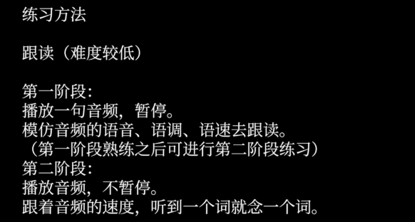
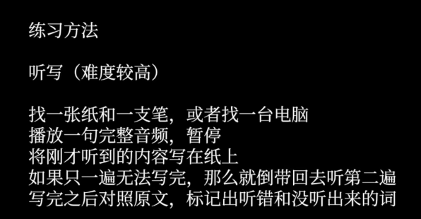

+++
author = "coucou"
title = "日报——20240204"
date = "2024-02-04"
description = "日报专题之20240204"
categories = [
    "daily"
]
tags = [
    "daily"
]
image = "1.jpg"
+++

<!--  -->

# February 4th, 2024  Sunday, Rainy


[watch New Year's videos.](./newyear.mp4) 

<!-- <video width="320" height="240" autoplay controls>
  <source src="./newyear.mp4" type="video/mp4">
  对不起，您的浏览器不支持内嵌视频。
</video> -->
Looking forward to tomorrow, and anticipating more wonderful moments to be captured and shared with everyone.

---

### qemu 
```java

```

### english article

Title: The Benefits of Reading

Reading is an activity that has been **cherished throughout** human history for its **profound** impact on the mind and personal growth.

 It's a **gateway** to **countless** worlds, times, and ideas, and offers **enumerable** benefits to those who engage with it regularly.


### listen

The reason I think this painting is so important is that it stresses the impressionist aspect of Frantzen's style.



